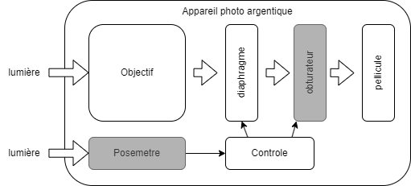
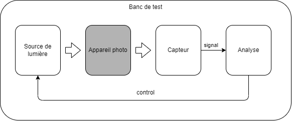

# Analyse opérationnelle

## Description du besoin
### Contexte métier
Dans le monde de la photographie, les appareils numériques, apparus sur le marché aux débuts des années 2000, ont totalement bouleversé le marché. L'industrie liée à la fabrication d'appareils photo argentique a presque totalement disparu, ne subsiste que quelques appareils de niche dans le très haut de gamme, ou dans le très bas de gamme (Lomo, Instax Fuji).  
La pratique de la prise de vue sur film argentique, elle, n'a pas disparu. Et même, à l'instar du vinyl en musique, elle connaît un regain d'intérêt auprès des jeunes générations. Cette pratique repose sur les appareils photos fabriqués pour la plupart il y a plus de 40 ans. Même s'il sont pour la plupart très robustes, ils ont besoin d'être régulièrement vérifiés et entretenus afin de pouvoir continuer à permettre des prises de vue nominales.  
Parmi les composants susceptibles de se dérêgler, on peut citer principalement:  
- Le posemetre, qui mesure l'intensité lumineuse de la scène
- L'obturateur, qui limite la durée d'exposition de la pellicule à la lumière, afin de l'adapter à l'intensité lumineuse.

Pour s'assurer du bon fonctionnement de ces composants, les maintenanciers s'appuyent sur des outils de test : les testeurs d'obturateurs.
Ces outils sont composés schématiquement de 3 composants logiques:
- __Une source de lumière__
- Un capteur
- Un composant d'analyse du signal

Ce projet se focalise sur les choix d'architecture relatifs à la définition et à la fabrication d'une source de lumière pour un testeur d'obturateur.  
Les autres sous-ensemble du testeur d'obturateur (capteur, composant d'analyse du signal, etc), ne font pas partie de l'étude mais en constituent l'interface.

### Le client
Le client (fictif) du projet est le fabriquant de testeurs d'obturateur. Il s'agit d'une structure de type TPE. Ses propres clients, les maintenanciers, sont les utilisateurs du système.  
Le client produit historiquement des appareils qui testent uniquement le composant "obturateur".  
Le client a le souhait d'élargir son offre d'appareils de mesure afin que ceux-ci puissent tester l'ensemble de la chaine de gestion de l'exposition des appareils photos, en incluant le posemetre, le composant de contrôle de l'exposition, le diaphragme et l'obturateur. Cet augmentation du périmètre entraine de nouvelles exigences sur son système, dont la source de lumière fait partie.  
Le client est compétent sur les composants capteur et analyse du signal. Il a besoin de support pour la conception et la mise en production de la source de lumière.   
Le client est très sensible à la fois aux couts récurrents et aux couts non récurrents.  

  
