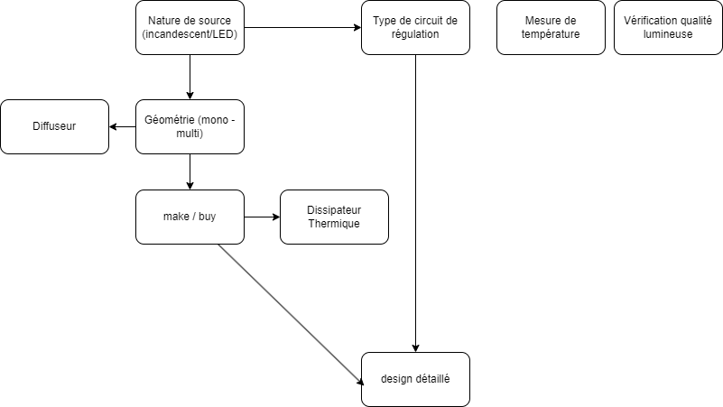

## Arbre Kd / Kg

### Type de circuit de régulation

Le circuit de régulation est destiné à controler l'intensité de la source lumineuse. L'objectif est de pouvoir piloter la source afin d'obtenir des valeurs calibrées d'intensité lumineuse, entre 8 et 16EV.

L'analyse bibliographique des différents types de circuits de régulation donne 3 catégories de solution:
- commutation sur séries de résistances : Selon la valeur d'éclairage voulue, le circuit commute sur une résistance qui permet d'obtenir le courant et donc l'intensité voulue. Un potentiomètre intégré dans chaque circuit permet de régler finement l'intensité pour chaque valeur d'IL
- circuit sur mesure à base d'ampli-op, de mosfet régulé par pwm : un ampli op régule (via un mosfet) le courant passant dans une résistance p/r à un tension de référence. La tension de référence est fournie par un PWM + capacité.
- utilisation de puces spécialisées ("LED driver")

| Solution | Positif | Négatif |
| - | - | - |
| Commutation sur séries de résistances | Possibilité d'étalonner indépendamment chaque valeur d'IL | Nombre de valeurs différentes en dur dans les circuits, composants dupliqués pour chaque valeur d'IL, temps passé à étaloner chaque valeur d'IL| 
| Circuit sur mesure à base d'ampli op | souplesse complete sur les valeurs possibles| cout de r&d important, risque sur les valeurs limites de tension et donc de la plage utilisable |
| Utilisation d'une puce "LED driver"| souplesse sur les valeurs possible, solution éprouvée pour cette utilisation, existence de schémas types | Attention au ripple possible, limitation possible en intensité |

Conclusion : choix de l'utilisation d'une puce "LED driver" à intégrer dans un circuit.

https://fr.amen-technologies.com/current-regulators-construction  
Circuit de régulation pour led:  
https://www.digikey.fr/en/products/detail/evvo/PT4115/22482069  
https://fr.farnell.com/c/composants-d-eclairage-led/driver-de-led/driver-de-led-dc-dc  
exemple: 
- FL7760
- AL8860
- 

